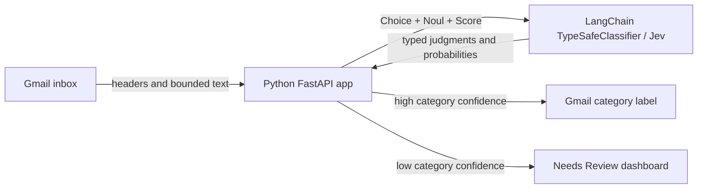

# Jev Inbox Classifier

A self-hosted Python/FastAPI Gmail organizer that uses TypeSafe Jev through LangChain to apply confidence-gated labels and route uncertain messages to a private review dashboard.

> The app is designed for one Google account and one continuously running instance. It never sends, archives, marks as read, or deletes email.

## What it does

- Classifies email as Action Required, Important, Finance, Meetings, Newsletters, Receipts, Social, Promotions, or Other.
- Uses `langchain_typesafe.TypeSafeClassifier` with the `jev-latest` model.
- Sends three independent typed judgments in one request:
  - `Choice` selects the Gmail category and returns its probability distribution and confidence.
  - `Noul` estimates the probability that the recipient must act.
  - `Score` rates urgency from routine (0) to urgent (2).
- Automatically labels only decisions at or above the configured confidence threshold.
- Routes uncertain decisions to **Jev/Needs Review** for human approval.
- Encrypts Google OAuth tokens at rest with AES-256-GCM.
- Stores message metadata and judgments in SQLite, but does not store email bodies or attachments.
- Supports manual runs and bearer-authenticated scheduled jobs.



Application code—not the model—enforces the confidence threshold, manages OAuth, and performs Gmail changes.

## Learn the decision pattern

After connecting Gmail, open **Decision Lab** on the dashboard. Paste a sample sender,
subject, and message, then select **Run typed decision**. The lab makes one Jev request
without reading, changing, or storing Gmail data and displays four stages:

1. `Choice` selects one inbox category and returns its full probability distribution
   plus confidence.
2. `Noul` returns the probability that the recipient needs to act. A Noul probability
   is the yes/no judgment itself; it is not a separate confidence value.
3. `Score` places urgency on the ordered routine-to-urgent scale.
4. `route_jev_decision` applies the configured threshold in ordinary Python. It either
   permits an automatic Gmail label or routes the message to human review.

The sample code in some Jev tutorials uses names such as `TypeSafeModel`, `Know`,
`evaluate`, or `JevRouter`. Those names are not exported by the
`langchain-typesafe==0.0.1a3` adapter installed here. This project uses the equivalent
adapter API:

| Tutorial concept | This project |
| --- | --- |
| Decision model | `TypeSafeClassifier(model="jev-latest")` |
| Yes/no probability | `Noul` |
| Fixed categorical options | `Choice` |
| Ordered severity or intensity | `Score` |
| Execute one typed request | `classifier.invoke(request)` |
| Route based on the result | `route_jev_decision(...)` in Python |

The human-review route is this project's fallback. It deliberately does not add an
OpenAI or Groq reasoning model: the Jev result stays inspectable, and application code
retains control of Gmail changes. See `app/jev.py` for question construction,
`app/routing.py` for policy, and `app/main.py` for the side-effect-free learning endpoint.

## Requirements

- Python 3.11 or newer
- A [TypeSafe API key](https://console.typesafe.ai/keys)
- A Google Cloud project with the Gmail API enabled
- A Gmail or Google Workspace account you control

No OpenAI API key is required.

> `langchain-typesafe` is currently a pre-release integration and is pinned to a tested version in `pyproject.toml`. Review its changelog and rerun the complete test suite before upgrading it.

## Quick start

### 1. Configure Google OAuth

1. Create or select a project in the [Google Cloud Console](https://console.cloud.google.com/).
2. Enable the **Gmail API**.
3. Configure the OAuth consent screen.
4. For private use, keep the app in testing mode and add your Gmail address as a test user.
5. Create an OAuth client with application type **Web application**.
6. Add `http://localhost:3000` as an authorized JavaScript origin.
7. Add `http://localhost:3000/api/auth/google/callback` as an authorized redirect URI.
8. Save the client ID and client secret.

The app requests `openid`, `email`, and `gmail.modify`. Google classifies `gmail.modify` as a restricted scope. A public multi-user rollout requires additional Google verification and may require a security assessment.

### 2. Create the environment file

```powershell
Copy-Item .env.example .env
```

Fill in the Google credentials, TypeSafe key, and permitted Gmail address. Generate three independent secrets by running this command three times:

```powershell
python -c "import secrets; print(secrets.token_urlsafe(32))"
```

Place one result in each of `APP_ENCRYPTION_KEY`, `SESSION_SECRET`, and `CRON_SECRET`. Keep `APP_ENCRYPTION_KEY` stable; losing it makes stored Google credentials unreadable.

### 3. Install and run

```powershell
python -m venv .venv
.\.venv\Scripts\Activate.ps1
python -m pip install -e ".[dev]"
uvicorn app.main:app --reload --host 127.0.0.1 --port 3000
```

Open [http://localhost:3000](http://localhost:3000), select **Connect Gmail**, then select **Classify now**.

## Configuration

| Variable | Required | Default | Purpose |
| --- | --- | --- | --- |
| `APP_URL` | Yes | — | Exact HTTP(S) application origin without a path |
| `ALLOWED_GOOGLE_EMAIL` | Yes | — | The only Google account permitted to sign in |
| `GOOGLE_CLIENT_ID` | Yes | — | Google OAuth web client ID |
| `GOOGLE_CLIENT_SECRET` | Yes | — | Google OAuth web client secret |
| `TYPESAFE_API_KEY` | Yes | — | Server-side key used by `TypeSafeClassifier` |
| `APP_ENCRYPTION_KEY` | Yes | — | Base64url-encoded 32-byte key for OAuth token encryption |
| `SESSION_SECRET` | Yes | — | Secret of at least 32 characters for signed sessions |
| `CRON_SECRET` | Yes | — | Secret of at least 32 characters for scheduled jobs |
| `DATABASE_PATH` | No | `./data/inbox-classifier.db` | SQLite database location |
| `CLASSIFICATION_CONFIDENCE_THRESHOLD` | No | `0.65` | Minimum Choice confidence for automatic labeling |
| `DEFAULT_BATCH_SIZE` | No | `25` | Messages processed per run, from 1 to 100 |
| `EMAIL_LOOKBACK_DAYS` | No | `30` | Inbox search window, from 1 to 3650 days |

## Scheduled classification

Call the protected endpoint from a scheduler:

```powershell
Invoke-RestMethod -Method Post `
  -Uri "http://localhost:3000/api/cron/classify" `
  -Headers @{ Authorization = "Bearer YOUR_CRON_SECRET" }
```

The app prevents overlapping jobs. Retryable TypeSafe failures use bounded exponential backoff. Failed emails remain available for a later run.

## Docker

Set `APP_URL` to the exact public HTTPS origin and update the Google OAuth origin and callback URI to match, then run:

```bash
docker compose up -d --build
```

The container runs as a non-root user, exposes `/api/health`, and stores SQLite data in the `inbox-data` volume. Do not run multiple replicas against the same SQLite database.

## Development

```powershell
ruff check .
ruff format --check .
mypy
pytest
```

The tests mock Jev and Google-facing seams; they do not require live credentials.

## Privacy and scope

- Credentials and API keys stay server-side.
- Email bodies are sent to TypeSafe for classification but are not saved locally.
- Attachment contents are excluded from Jev state and are never fetched through the
  Gmail attachments API.
- State-changing dashboard routes require a signed session and same-origin request.
- The current architecture is single-account, single-instance, SQLite-backed, and English-first.

Review [TypeSafe's data-handling documentation](https://docs.typesafe.ai/models#data-handling) and Google's OAuth policies before using regulated or confidential email.

## License

This project is available under the [MIT License](LICENSE).
